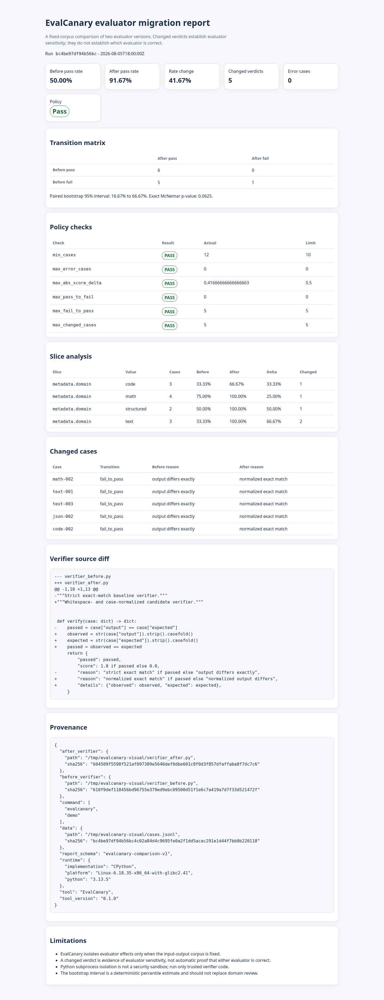

# EvalCanary

**Catch evaluation drift before it ships.**

EvalCanary shows exactly which fixed evaluation results change when a verifier, scorer, rubric implementation, or grading rule changes.

It treats an evaluator update as a migration:

- replay the same output corpus against both versions;
- classify every verdict transition;
- estimate paired uncertainty;
- inspect subgroup effects;
- attach source and execution provenance;
- enforce explicit CI policy gates.

EvalCanary does not determine automatically which evaluator is correct. It exposes the change packet that a domain reviewer needs.



## Why

Aggregate benchmark scores can remain nearly unchanged while many individual cases reverse in opposite directions. In reinforcement learning with verifiable rewards, an evaluator defect can become a training signal rather than merely a reporting error.

## Five-minute start

Requires Python 3.11 or later.

```console
python -m venv .venv
.venv/bin/python scripts/bootstrap_local.py
.venv/bin/evalcanary demo --out evalcanary-demo
```

Windows PowerShell:

```powershell
py -3.11 -m venv .venv
.venv\Scripts\python.exe scripts\bootstrap_local.py
.venv\Scripts\evalcanary.cmd demo --out evalcanary-demo
```

Open `evalcanary-demo/report/report.html`.

## Compare two verifiers

Every JSONL object requires a unique `id`. The same fixed object is passed to both verifiers.

```json
{"id":"math-001","expected":"4","output":"4 ","metadata":{"domain":"math"}}
```

Each trusted Python verifier defines `verify(case)` and returns either a boolean or a dictionary containing boolean `passed`.

```python
def verify(case: dict) -> dict:
    passed = case["output"].strip() == case["expected"]
    return {
        "passed": passed,
        "score": 1.0 if passed else 0.0,
        "reason": "normalized exact match",
    }
```

Run:

```console
evalcanary diff \
  --data outputs.jsonl \
  --before verifier_before.py \
  --after verifier_after.py \
  --policy evalcanary.toml \
  --slice metadata.domain \
  --out evalcanary-report
```

Outputs:

- `report.json` for automation;
- `report.md` for pull requests and research records;
- `report.html` for accessible local review.

Source code is not embedded in reports by default. Add `--include-source-diff`
only when the verifier files are safe to disclose to the report audience.
Original case payloads likewise require the separate `--include-content` flag.

## CI policy

```toml
[policy]
min_cases = 100
max_error_cases = 0
max_abs_score_delta = 0.005
max_pass_to_fail = 10
max_fail_to_pass = 10
max_changed_cases = 15
require_statistical_review_below_p = 0.05
```

Exit codes:

- `0`: comparison completed and configured policy passed;
- `2`: comparison completed and configured policy failed;
- `3`: input, execution, or configuration error.

## Public boundary

Version 0.1 supports trusted deterministic Python verifiers and pass/fail migration analysis. It does not yet provide:

- an untrusted-code sandbox;
- repeated LLM-judge sampling;
- semantic perturbation generation;
- hosted storage or dashboards;
- automatic causal attribution;
- a general benchmark runner.

## Documentation

- `docs/PROJECT_DESIGN.md`
- `docs/VERIFIER_API.md`
- `docs/POLICY.md`
- `docs/REPORT_SCHEMA.md`
- `docs/ASSURANCE.md`
- `docs/ROADMAP.md`
- `docs/NAME_CLEARANCE.md`

## Trust model

A changed verdict demonstrates evaluator sensitivity. It does not demonstrate that the previous evaluator was wrong, that the candidate is better, or that a benchmark conclusion is invalid. Reports preserve that distinction explicitly.

## License

MIT
