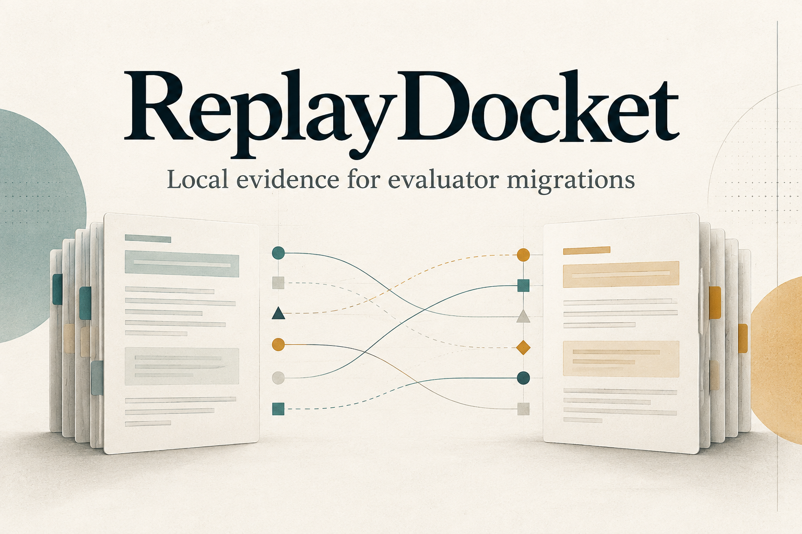
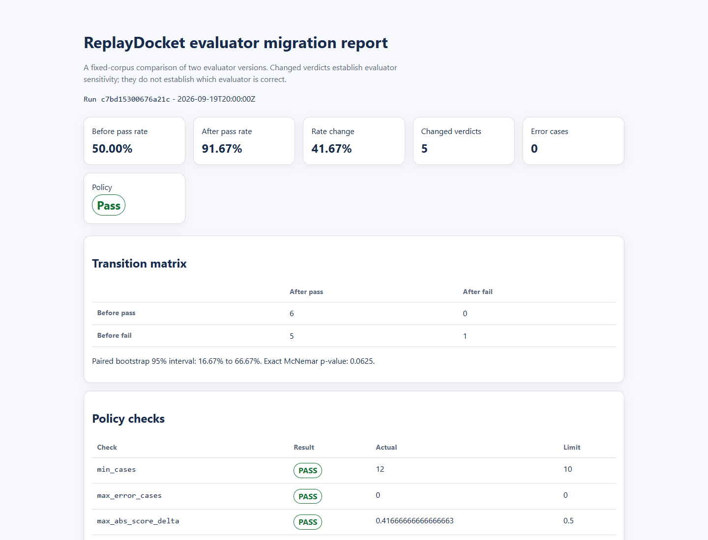

# ReplayDocket

[](https://github.com/lmdixon23/evalcanary/actions/workflows/ci.yml)
[](https://github.com/lmdixon23/evalcanary/actions/workflows/codeql.yml)
[](https://www.python.org/)
[](LICENSE)

**Local evidence for evaluator migrations**



ReplayDocket compares evaluator/verifier versions and produces deterministic,
reviewable evidence with provenance, explicit contracts and policy gates.

For the data-only `migrate` workflow: compare frozen evaluator outputs across
versions and produce deterministic, reviewable evidence without rerunning the
evaluator. The legacy `diff` workflow executes trusted verifier code.

The legacy `diff` workflow treats an evaluator update as a migration:

- replay the same output corpus against both versions;
- classify every verdict transition;
- estimate paired uncertainty;
- inspect subgroup effects;
- attach source and execution provenance;
- enforce explicit CI policy gates.

ReplayDocket does **not** determine automatically which evaluator is correct. It
produces the change packet that a domain reviewer needs.

See the [name and installation migration note](docs/MIGRATION.md) for the
stable Python API, compatibility command and historical release boundary.

## Why evaluator migrations need their own diff

An aggregate benchmark score can remain nearly unchanged while many individual
cases reverse in opposite directions. In reinforcement learning with verifiable
rewards, an evaluator defect can become a training signal rather than merely a
reporting error.

The `diff` workflow holds the model-output corpus fixed and changes only the
trusted evaluator implementation. The `migrate` workflow compares already-produced
outputs with their declared context and provenance; it does not rerun evaluators.

## Five-minute local start

Requires Python 3.11 or later. The runtime has no third-party dependencies.
These commands use the current source checkout. ReplayDocket is the successor
public name beginning with v0.2; v0.1.0/v0.1.1 were released as EvalCanary.
This checkout prepares the 0.2.0 release candidate; it is not yet a published
release. Use the candidate checkout supplied for review until it is merged.
Run the following commands from that checkout's root.

```console
python -m venv .venv
.venv/bin/python scripts/bootstrap_local.py
.venv/bin/replaydocket demo --out evalcanary-demo
```

Windows PowerShell:

```powershell
py --version
py -m venv .venv
& .\.venv\Scripts\python.exe .\scripts\bootstrap_local.py
& .\.venv\Scripts\replaydocket.cmd demo --out .\evalcanary-demo
```

Open `evalcanary-demo/report/report.html`.



[Mobile capture](docs/assets/replaydocket-demo-mobile.png) /
[Capture provenance](docs/assets/README.md). Both show the synthetic trusted-verifier
demo, not the data-only assurance report.


## Try the bundled offline assurance example

From the repository root, using the environment's `replaydocket` command
(`.venv/bin/replaydocket` or `.\.venv\Scripts\replaydocket.cmd`):

```console
replaydocket migrate --preflight --input src/evalcanary/examples/assurance/numeric.jsonl
replaydocket migrate --input src/evalcanary/examples/assurance/numeric.jsonl --out numeric-assurance-report
```

This synthetic example has no acceptance contract. Exit 0 with
`CONTRACT_NOT_CONFIGURED` establishes completed evidence generation, not policy
approval. Choose fresh output directories for examples; `demo` replaces its
destination. For installed-package example locations and contract review, see
the [packaged guide](src/evalcanary/examples/assurance/README.md).

The public heading is ReplayDocket. Canonical evidence may still say
`EvalCanary` in provenance and limitations; these are stable compatibility
identities, explained in the [migration guide](docs/MIGRATION.md).

## Use the GitHub Action

The caller must set up Python 3.11 or later. This example intentionally uses
the historical EvalCanary v0.1.1 Action, with its existing trusted-verifier
`diff` behavior. The repository and historical Action addresses are unchanged.

```yaml
name: Evaluator migration

on:
  pull_request:

permissions:
  contents: read

jobs:
  evaluator-diff:
    runs-on: ubuntu-latest
    steps:
      - uses: actions/checkout@3d3c42e5aac5ba805825da76410c181273ba90b1 # v7.0.1
      - uses: actions/setup-python@5fda3b95a4ea91299a34e894583c3862153e4b97 # v7.0.0
        with:
          python-version: "3.11"
      - name: Compare evaluator versions
        id: evalcanary
        uses: lmdixon23/evalcanary@v0.1.1
        with:
          data: outputs.jsonl
          before: verifier_before.py
          after: verifier_after.py
          policy: evalcanary.toml
          slice: |
            metadata.domain
            metadata.language
          output: evalcanary-report
      - name: Upload review packet
        if: always()
        uses: actions/upload-artifact@043fb46d1a93c77aae656e7c1c64a875d1fc6a0a # v7.0.1
        with:
          name: evalcanary-report
          path: evalcanary-report
          if-no-files-found: error
```

Action outputs:

- `report_directory`;
- `report_json`;
- `report_markdown`;
- `report_html`;
- `run_id`;
- `changed_cases`;
- `policy_passed` (`true`, `false`, or `not-configured`).

The action executes both verifier files with the runner account's permissions.
It is process isolation, **not a security sandbox**. Use only trusted verifier
code.

## Compare two verifiers from the CLI

Every JSONL object requires a unique `id`. The same fixed object is passed to
both verifiers.

```json
{"id":"math-001","expected":"4","output":"4 ","metadata":{"domain":"math"}}
```

Each trusted Python verifier defines `verify(case)` and returns either a
boolean or a dictionary containing boolean `passed`.

```python
def verify(case: dict) -> dict:
    passed = case["output"].strip() == case["expected"]
    return {
        "passed": passed,
        "score": 1.0 if passed else 0.0,
        "reason": "normalized exact match",
    }
```

Run:

```console
replaydocket diff \
  --data outputs.jsonl \
  --before verifier_before.py \
  --after verifier_after.py \
  --policy evalcanary.toml \
  --slice metadata.domain \
  --out evalcanary-report
```

Outputs:

- `report.json` for automation;
- `report.md` for pull requests and research records;
- `report.html` for accessible local review.

Source code is not embedded in reports by default. Add
`--include-source-diff` only when the verifier files are safe to disclose to
the report audience. Original case payloads likewise require the separate
`--include-content` flag. Absolute and parent paths are reduced to basenames in
report provenance and recorded commands; content hashes provide artifact
identity.

## Analyze a frozen evaluator migration

Compare frozen evaluator outputs across versions and produce deterministic,
reviewable evidence without rerunning the evaluator.

The `migrate` path consumes a strict, data-only assurance artifact.
It does not import or run evaluators, benchmark tasks, patches, or model output,
and report generation makes no network request.

```console
replaydocket migrate \
  --input evaluator-assurance.jsonl \
  --contract evaluator-contract.json \
  --out evaluator-assurance-report
```

The optional contract uses a closed metric vocabulary and hard, review, or
informational severities. Output is one canonical JSON model plus fact-parity
Markdown and accessible, scriptless HTML, together with exhaustive JSON and
bounded Markdown review queues. Reports and queues are metadata-only by default.
Use `migrate --preflight` for validation-only authoring diagnostics, `schema`
for the four offline structural contracts, and `init` for an inert scaffold.
See the [evaluator-assurance reference](docs/EVALUATOR_ASSURANCE.md) for the
schema boundary, privacy rules, resource limits, and exit statuses.

## CI policy for trusted-verifier diff

```toml
[policy]
min_cases = 100
max_error_cases = 0
max_abs_score_delta = 0.005
max_pass_to_fail = 10
max_fail_to_pass = 10
max_changed_cases = 15
require_statistical_review_below_p = 0.05
```

Exit codes:

- `0`: comparison completed with no policy, or the configured policy passed;
- `2`: comparison completed and the configured policy failed;
- `3`: input, execution, or configuration error.

Command syntax errors also use exit 2. The separate `migrate` workflow uses
exit 4 for required review; see its reference.

## Public boundary

The 0.2.0 candidate supports trusted deterministic Python verifier replay and
offline analysis of frozen categorical and numeric judgments. It does not provide:

- an untrusted-code sandbox;
- repeated LLM-judge sampling;
- semantic perturbation generation;
- hosted storage or dashboards;
- automatic causal attribution;
- a general benchmark runner.

## Documentation

- [Project design](docs/PROJECT_DESIGN.md)
- [Verifier API](docs/VERIFIER_API.md)
- [Policy reference](docs/POLICY.md)
- [Report schema](docs/REPORT_SCHEMA.md)
- [Evaluator-assurance reference](docs/EVALUATOR_ASSURANCE.md)
- [Product assurance](docs/ASSURANCE.md)
- [Release procedure](docs/RELEASING.md)
- [Roadmap](docs/ROADMAP.md)
- [Name-clearance record](docs/NAME_CLEARANCE.md)

## Trust model

A changed verdict demonstrates evaluator sensitivity. It does not demonstrate
that the previous evaluator was wrong, that the candidate is better, or that a
benchmark conclusion is invalid. Reports preserve that distinction explicitly.

## Contributing and security

See [CONTRIBUTING.md](CONTRIBUTING.md) for the development and review gates.
Report security issues through the private process described in
[SECURITY.md](SECURITY.md), not through a public issue.

## License

MIT
